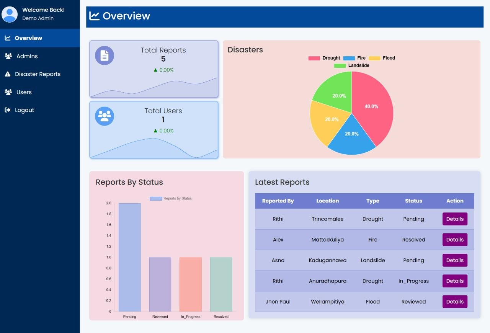
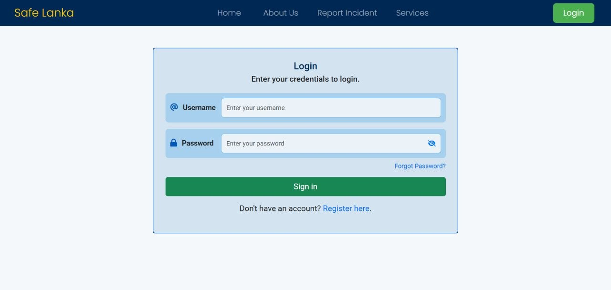
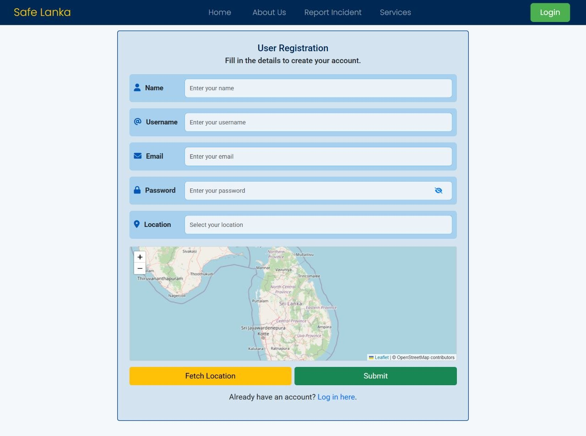
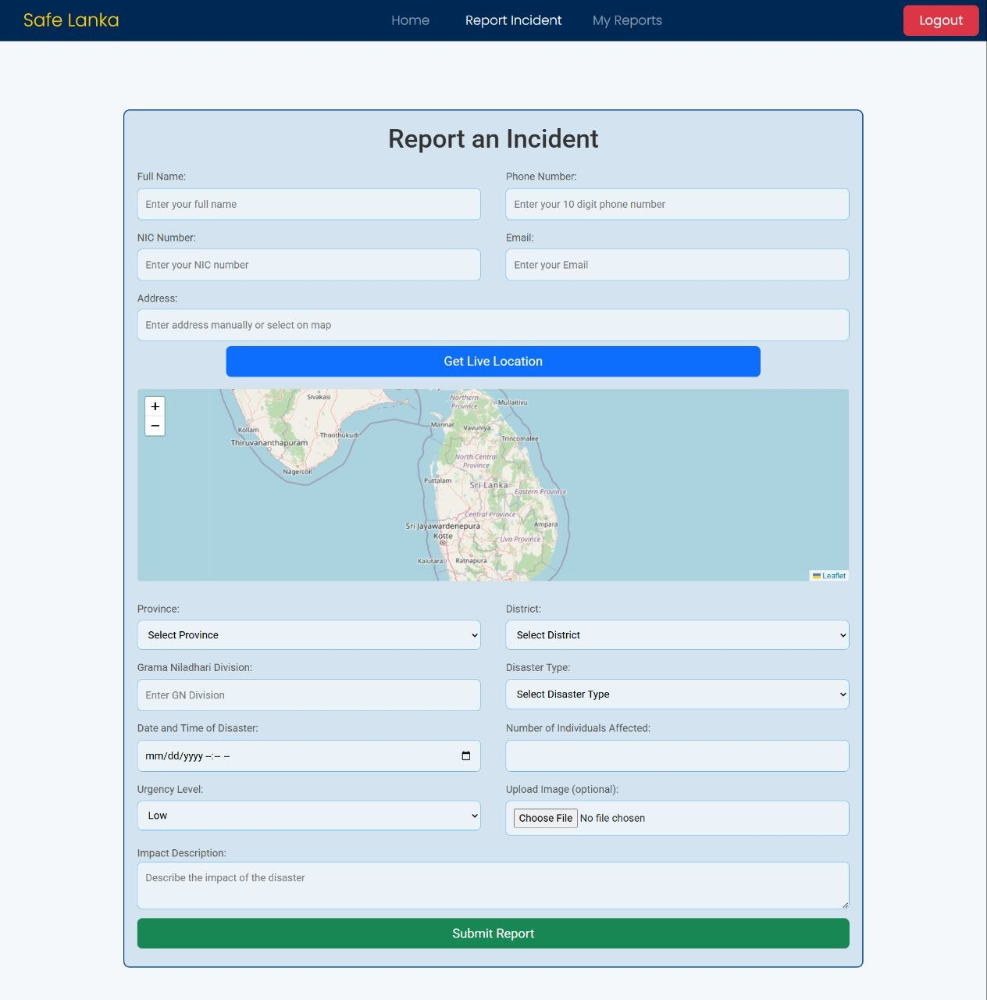

# 🚨 Disaster Management System 

A web-based disaster management platform built with **Spring Boot**, **MySQL**, and **Thymeleaf**. The system allows users to register, report disasters, and track their reports — while admins can manage all reports, update their statuses, and oversee the user base.

---

## Screenshots

### Admin Dashboard





### Login Page





### Register Page





### User Report Incident Form





> 📂 For more UI screenshots, please refer to the [screenshots](screenshots/) folder.

---

## Table of Contents

- [Features](#features)
- [Tech Stack](#tech-stack)
- [Prerequisites](#prerequisites)
- [Getting Started](#getting-started)
- [First Admin Setup](#first-admin-setup)
- [Configuration](#configuration)
- [Usage](#usage)
- [Project Structure](#project-structure)

---

## Features

### User 👤
- Register and log in via a shared login page
- Submit disaster reports
- View all personal reports and their current status

### Admin 🛡️
- Log in via the same shared login page (role-based redirect after login)
- Add new admin accounts after logging in
- View all registered users
- View and manage all disaster reports
- Update report statuses (e.g. Pending → Approved)

---

## Tech Stack

| Layer | Technology |
|---|---|
| Backend | Java 17, Spring Boot |
| Frontend | Thymeleaf, HTML, CSS |
| Database | MySQL |
| ORM | Spring Data JPA / Hibernate |
| Security | Spring Security |
| Build Tool | Maven (via Maven Wrapper) |

---

## Prerequisites

Make sure the following are installed before running the project:

| Tool | Version | Notes |
|---|---|---|
| Java (JDK) | 17 | [Download here](https://www.oracle.com/java/technologies/javase/jdk17-archive-downloads.html) |
| MySQL | 8+ | Must be running before starting the app |
| Git | Any | For cloning the repository |
| Maven | Not required | Included via `mvnw` Maven Wrapper |

---

## Getting Started

### 1. Clone the repository

```bash
git clone https://github.com/asnaassalam/disaster-management-system.git
cd disaster-management-system
```

### 2. Set up the database

Create a MySQL database:

```sql
CREATE DATABASE disaster_management_project;
```

### 3. Configure the application

Copy the example properties file and fill in your credentials:

```bash
cp src/main/resources/application.properties.example src/main/resources/application.properties
```

Then edit `application.properties` with your MySQL username and password.

### 4. Run the application

```bash
./mvnw spring-boot:run
```

On Windows:

```bash
mvnw.cmd spring-boot:run
```

### 5. Open in browser

> ⚠️ **Important:** The root URL `http://localhost:8080/` has no page and will show an error.

Start here:

```
http://localhost:8080/user/index
```

---

## First Admin Setup

> 🔒 For privacy and security reasons, the **first admin must be inserted manually** into the database. Once logged in, that admin can add further admins through the application.

After the application has started (so Hibernate has created the tables), run the following SQL query in your MySQL client:

```sql
INSERT INTO admin (
  name,
  email,
  username,
  password,
  role,
  enabled,
  created_at,
  updated_at
) VALUES (
  'Demo Admin',
  'admin@gmail.com',
  'demo_admin',
  'Admin@123',
  'ADMIN',
  1,
  NOW(),
  NOW()
);
```

Then log in at:

```
http://localhost:8080/user/login
```

Using these credentials:

| Field | Value |
|---|---|
| Username | `demo_admin` |
| Password | `Admin@123` |

---

## Configuration

The `application.properties` file is **not committed** to this repository to protect sensitive credentials. Use the provided `application.properties.example` as a template.

Key settings to configure:

```properties
spring.datasource.url=jdbc:mysql://localhost:3306/disaster_management_project
spring.datasource.username=your_username
spring.datasource.password=your_password
```

The database schema is auto-managed by Hibernate (`ddl-auto=update`), so tables will be created automatically on first run.

---

## Usage

### Role System 🔐

Both users and admins share the **same login page** at `/user/login`. Role assignment works as follows:

| Action | Role Assigned |
|---|---|
| Self-registration | `USER` |
| Admin adds new admin | `ADMIN` |

After a successful login, the system automatically redirects based on the user's role:

| Role | Redirected To |
|---|---|
| `USER` | Report Incident form page |
| `ADMIN` | Admin dashboard |

### Key URLs

> ⚠️ `http://localhost:8080/` is not a valid page — always use the URLs below directly.

| Page | URL |
|---|---|
| Login | `http://localhost:8080/user/login` |
| User Home | `http://localhost:8080/user/index` |

---

## Project Structure

```
src/
├── main/
│   ├── java/project/java/projectdisastermanagement/
│   │   ├── controller/       # MVC Controllers
│   │   ├── model/            # Entity classes
│   │   ├── repository/       # JPA Repositories
│   │   └── service/          # Business logic
│   └── resources/
│       ├── templates/        # Thymeleaf HTML templates
│       ├── static/           # CSS, JS, images
│       └── application.properties.example
└── test/
    └── java/project/java/projectdisastermanagement/
```

---

## Notes 📌

- Session timeout is set to **10 minutes** by default
- Spring Security debug logging is enabled in development — disable for production
- Make sure MySQL is running before starting the application
- The embedded Tomcat server runs on port **8080** by default
